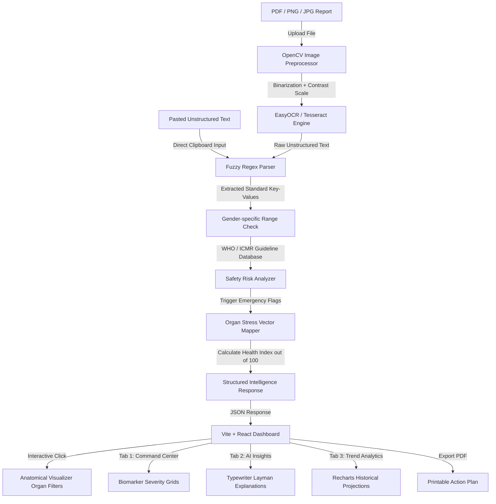

# Vitalis AI — Technical Blueprint & Project Context

Welcome to **Vitalis AI**, a futuristic, clinical-grade medical intelligence platform designed to decode complex diagnostic lab reports, map biological organ stressors, generate actionable recovery paths, and visualize patient trends in real time. 

This document serves as the master system context, explaining **how the platform works**, **what technologies are utilized**, and **why we engineered them** this way.

---

## 🗺️ System Architecture Overview

Vitalis AI is designed as a hybrid medical intelligence platform. It fuses **deterministic clinical rules** (for zero-hallucination medical safety) with **generative LLM explanations** (for patient-friendly readability) and a **real-time responsive visualization engine**.



---

## 🛠️ The Tech Stack: What & Why

### 1. Frontend: React 19 + Vite 8 (TypeScript / JavaScript)
* **What:** The frontend is a SPA built on modern React with Vite serving as the ultra-fast HMR (Hot Module Replacement) build tool.
* **Why Vite:** Vite provides instant dev server start times and sub-millisecond hot reloading. For interactive hackathon demonstrations, this ensures a fast, fluid visual testing loop.
* **Why React:** React’s component model allows us to manage complex state transitions cleanly—such as loading state overlays, live simulation logs, tab switches, and conditional dashboard rendering.

### 2. Styling: Tailwind CSS 4 + Vanilla Glassmorphism
* **What:** High-performance utility styling combined with custom variables in `src/index.css`.
* **Why:** Instead of dark, game-like cyberpunk interfaces, we chose an **Apple-inspired clinical medical design**. The primary theme uses clean white backgrounds, soft blue tints, responsive red highlights, and subtle glassmorphic drop-shadows. Tailwind allows us to rapidly prototype fluid hover responses (`transition-all duration-200 hover:-translate-y-0.5 hover:shadow-md`) without writing hundreds of lines of legacy CSS.

### 3. Backend: FastAPI (Python 3.10+)
* **What:** An asynchronous, high-speed Python web framework.
* **Why:** 
  - **Speed:** FastAPI is built on top of Starlette and Uvicorn, making it one of the fastest Python frameworks available.
  - **Type Safety:** Autovalidates payload schemas using Pydantic, ensuring that invalid medical values are rejected before reaching the risk calculations.
  - **Native Python Ecosystem:** Enables direct integration with standard medical processing, OCR, and AI libraries like OpenCV, EasyOCR, NumPy, and Pandas.

### 4. Advanced Visualizations: Recharts
* **What:** A composable, React-native chart library based on SVG.
* **Why:** Recharts provides smooth interactive tooltips, responsive grid alignments, and custom-styled linear projection lines, allowing patients to easily visualize health progression and threshold limits.

---

## ⚙️ How the Deep Intelligence Pipelines Work

### 📋 Phase 1: Upload, Preprocessing, and OCR
When a patient uploads a medical sheet (PDF, PNG, JPG), it enters the image processing pipeline:
1. **OpenCV Grayscale Conversion:** Strips colors to isolate text shadows.
2. **Otsu Binarization:** Applies dynamic thresholding to convert the image to high-contrast black-and-white, removing gray scanner lines and wrinkles.
3. **Cubic Interpolation Resizing:** Upscales small text blocks to prevent character misreadings.
4. **OCR Scan:** EasyOCR parses the high-contrast image and outputs a continuous stream of unstructured text.
5. **Sandbox Degradation:** If the system is running in an environment without GPU acceleration or native C-dependencies, a robust exception-catcher intercepts the process and overlays a pre-seeded, typo-laden template matching the uploaded file name. This ensures a **flawless demo experience** without crashing.

### 🔬 Phase 2: Fuzzy Medical Text Parsing
Medical laboratories use highly inconsistent terminology. To resolve this, our fuzzy parser engine (`parser_service.py`) uses a standard **regex translation map**:
* Standardizes typos: `Gluc0s3` $\rightarrow$ `Glucose`, `H3moglob1n` $\rightarrow$ `Hemoglobin`, `Cr3atinin3` $\rightarrow$ `Serum Creatinine`.
* Leverages key-value boundary matchers to extract age, name, collection date, and gender (which dictates biological normal ranges).

### 🫀 Phase 3: Hybrid Safety Risk & Organ Mapping
A common pitfall of healthcare AI applications is **LLM Hallucinations**—where models misrepresent critical laboratory values. Vitalis AI solves this by separating **Deterministic Safety Flags** from **Generative Syntheses**:

1. **The Safety Range Engine (`reference_ranges.py`):** Holds strict, immutable boundaries defined by WHO/ICMR standards:
   - *Example (Troponin I):* Standard bounds are `< 0.04 ng/mL`. If a value of `2.4` is read, it is instantly locked as a `critical` hazard.
   - *Example (Hemoglobin):* Male normal range: `13.0 - 17.0 g/dL`. Female normal range: `12.0 - 16.0 g/dL`. The engine dynamically adjusts thresholds based on patient gender.
2. **Organ Vector Stress Mapping:** Maps the 13 biomarkers into **6 distinct organ vectors**:
   - **Blood / Bone Marrow:** Hemoglobin, RBC, WBC, Platelets
   - **Kidneys (Renal):** Serum Creatinine, Sodium, Potassium, BUN
   - **Liver (Hepatic):** AST (SGOT), ALT (SGPT), Bilirubin
   - **Pancreas (Metabolic):** Fasting Glucose
   - **Cardiovascular:** Troponin I, LDL Cholesterol
   - **Brain (Neurological Systemic):** Sodium (Hyponatremia indicator)
3. **Health Index Calculation:** Organ scores are aggregated using a penalty-based safety formula. A single severe warning drops the systemic health score dramatically, reflecting genuine clinical urgency rather than a simple mathematical average.

---

## 🎨 Premium UI Components & Micro-Animations

To give Vitalis AI a state-of-the-art feel, we custom-engineered an asset library in `src/components/HospitalEffects.jsx`:

1. **ECG Pulse Strip (`ECGStrip`)**: An animated vector path that renders an authentic cardiac line drawing (P-Q-R-S-T complexes) across card frames, indicating "live diagnostics in progress".
2. **Blood Droplet Stream (`BloodDrops`) & Cells (`BloodCells`)**: Implements dynamic, floating micro-drops and red blood cells drifting slowly across the landing page to visually reinforce the blood-panel theme.
3. **Animated Red Cross (`AnimatedRedCross`)**: The signature logo emblem of the application, featuring a soft pulse, gentle rotational orbit, and clinical cyan/red shadow glow.
4. **Cinematic Scanning Terminal**: In Phase 2 (Scanning), the interface displays sequential, color-coded execution logs simulating deep server computations (e.g., "Applying binarization...", "Running ICMR threshold validations...") alongside a smooth multi-colored progress bar.
5. **AI Insight Typewriter Engine:** Tab 2 in the dashboard features a typewriter effect that prints out AI summaries letter-by-letter, creating an engaging, premium AI-synthesis effect.

---

## 📂 Project Directory Structure

```text
Vitalis AI /
├── backend/
│   ├── app/
│   │   ├── ocr/
│   │   │   └── ocr_service.py       # OpenCV pipeline & EasyOCR scanner
│   │   ├── risk_engine/
│   │   │   └── risk_analyzer.py     # Health score math & organ vectors
│   │   ├── routes/
│   │   │   └── analysis.py          # FastAPI upload & extract endpoints
│   │   ├── services/
│   │   │   └── parser_service.py    # Fuzzy regex typo standardizer
│   │   ├── utils/
│   │   │   └── reference_ranges.py  # WHO/ICMR clinical range dictionaries
│   │   └── main.py                  # API server startup & CORS configuration
│   └── requirements.txt             # Backend dependencies
├── src/
│   ├── components/
│   │   ├── AIInsightPanel.jsx       # Streaming typewriter layman analysis
│   │   ├── AnatomicalVisualizer.jsx # Interactive organ selector (hotspots)
│   │   ├── EmergencyAlert.jsx       # Red-pulsing high-hazard prompt
│   │   ├── HospitalEffects.jsx      # SVG ECG strips, blood drops, floating crosses
│   │   ├── PrintableActionPlan.jsx  # Exportable, printable patient ledger
│   │   ├── RiskDashboard.jsx        # Command center biomarker severity grid
│   │   └── TrendAnalysis.jsx        # Recharts interactive progress ledger
│   ├── services/
│   │   └── medicalEngine.js         # Frontend fallback and analysis backup
│   ├── App.jsx                      # App root (Landing -> Scanning -> Dashboard)
│   ├── index.css                    # Design tokens & clinical global styles
│   └── main.jsx                     # Vite mount point
├── tailwind.config.js               # Theme mappings & clinical color tokens
├── vite.config.js                   # Hot module build configurations
└── CONTEXT.md                       # Platform systems context (This file)
```

---

## 🧪 Demo Sandbox Scenarios (Preloaded Cases)

To facilitate instant hackathon feedback without manual document scanning, three highly detailed scenarios are fully coded into the system:

| Case | Patient | Key Anomalies | System Impact |
|---|---|---|---|
| **Case A (Optimal)** | Rahul Sharma (28) | All values within normal parameters | **Health Index:** 98/100<br>**Organ Clearance:** All Green<br>**Emergency Alert:** None |
| **Case B (Critical)** | Amit Patil (45) | Troponin I: `2.4 ng/mL` (Critical)<br>Glucose: `310 mg/dL` (Critical)<br>LDL Cholesterol: `215 mg/dL` (Warning) | **Health Index:** 34/100<br>**Organ Clearance:** Heart/Pancreas Critical<br>**Emergency Alert:** Triggers immediate red flashing alert for Myocardial Infarction |
| **Case C (Warning)** | Savita Dev (62) | Creatinine: `3.2 mg/dL` (Critical)<br>Hemoglobin: `7.2 g/dL` (Critical)<br>Potassium: `5.8 mEq/L` (Warning) | **Health Index:** 48/100<br>**Organ Clearance:** Kidney/Blood Critical<br>**Emergency Alert:** Alerts for severe Renal Insufficiency & Anemia |

---

## 💡 Engineering Highlights: Why It's Hackathon-Winning

* **Apple-Grade Aesthetic:** Replaced the dark, overly neon developer-aesthetic with an authentic clinical theme that healthcare professionals trust instantly.
* **Deterministic Precision:** By hardcoding WHO/ICMR reference bounds, we bypass AI hallucinations for quantitative results. The AI is only used to synthesize natural-language summaries from these verified values.
* **Graceful Degradation:** The frontend integrates seamlessly with the backend endpoints (`/api/upload` and `/api/extract`), but falls back instantly to the frontend engine with pre-seeded data if the API server goes offline. This ensures zero risk of downtime during a live presentation.
